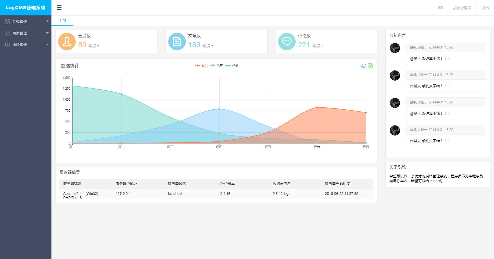
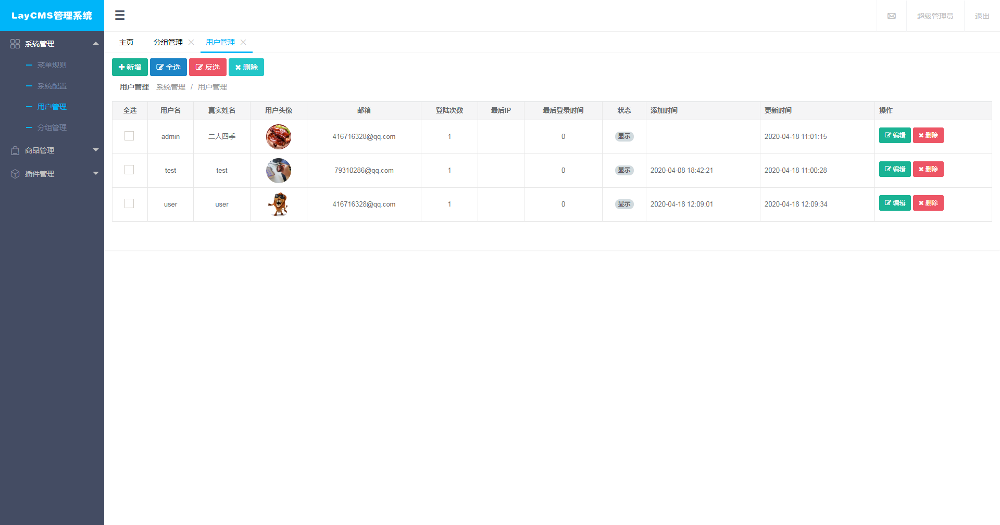
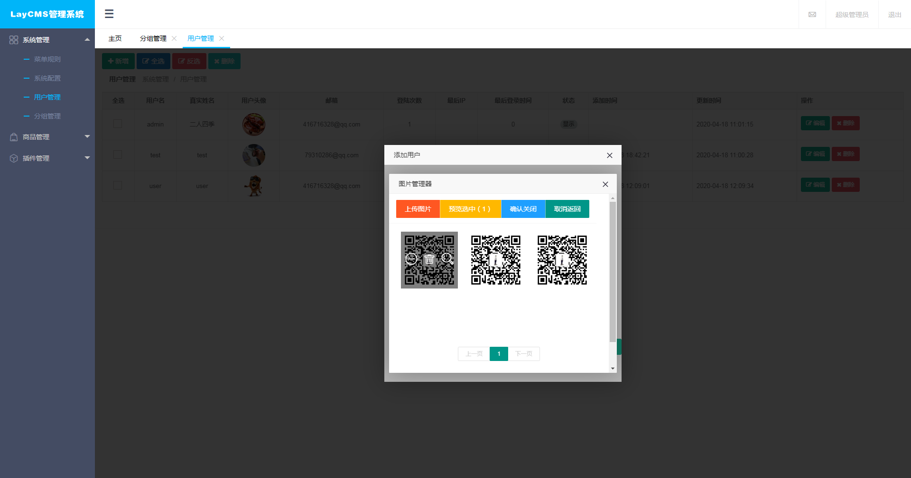
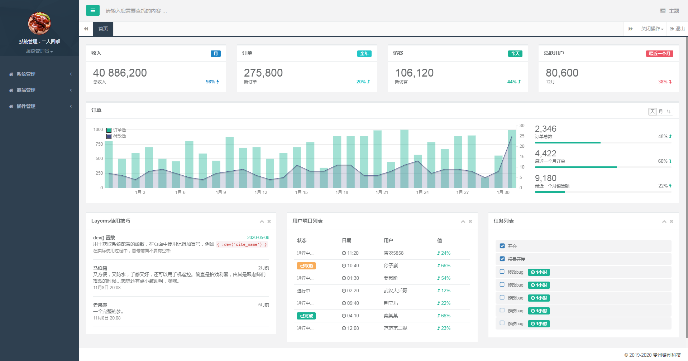
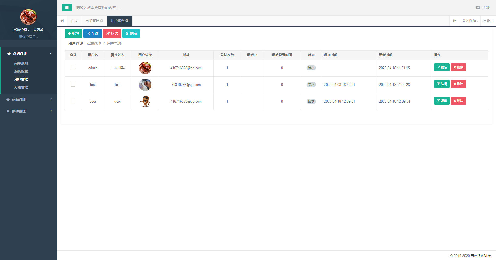
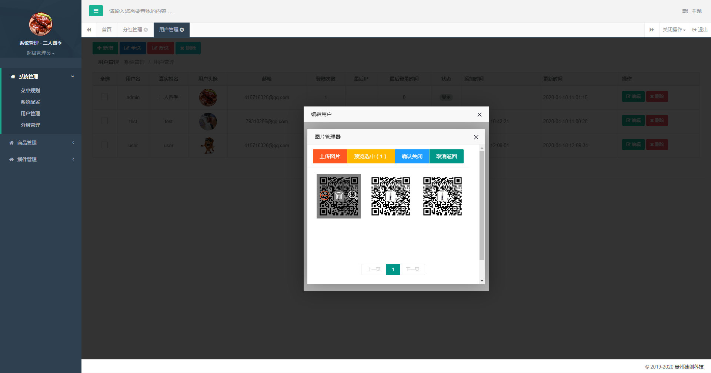

# laycms

#### 我*&%￥#……#￥￥%……
希望可以做一套优秀的后台管理系统，程序员不为难程序员，你认同不？

#### 康康%$^%$&@#%$#
受疫情影响，在家实在闲得无聊，准备开发一套小小的后台管理系统，开发了两套模板样式的，但是有点臃肿，想选择其中一个，你们觉得哪个好看一点？

#### 基于Layui的模板

#### 使用H+的后台模板

#### 切换&……%（￥#@……￥#@……￥R&模板

1. app\admin\config\view.php
2. 修改 view_dir_name
3. 代码里面有示例说明

#### 强调@%……￥*&……#￥&*……&%￥*￥#

1. 本项目目前为测试阶段，代码冗余纯属正常
2. 正式发布之后将会去除冗余代码，嫌弃的请忽视即可
3. 想要静态模板的加我私人微信：NBA542426，也可关注公众号：贰人四季 与我取得联系
4. 后台账号：admin 密码：123456
5. 如果你觉得本项目对你有所帮助，还请给个star，以表示对我的最大支持
6. 继续投简历了......